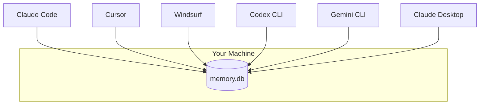

## The problem with vendor-locked memory

Claude has built-in memory. So does GPT. But they don't talk to each other.

If you use Claude Code for backend work and Cursor for frontend, your backend decisions are invisible to your frontend agent. Switch to Codex for a deploy script? Start from zero.

## One SQLite, every agent

Linksee Memory stores everything in a **single SQLite file** on your machine. Any MCP-compatible client can read and write to it.

When Claude Code stores a caveat about a Supabase issue, Cursor sees it immediately. When Cursor discovers an API quirk, Codex can recall it.

## No cloud. No account. No sync conflicts.

- The database is a local file — no cloud dependency
- No account registration required
- No API keys to manage
- Multiple agents can read simultaneously (SQLite WAL mode)
- File-level locking prevents concurrent write corruption

## What cross-agent looks like

**Session 1** (Claude Code):
> "Remember: the freee API returns dates in JST, not UTC. Our conversion layer is in `src/utils/date.ts`."

**Session 2** (Cursor, different project window):
> "I'm building a freee integration. What do I need to know?"

Cursor calls `recall("freee")` and gets:
- The JST date caveat
- The `date.ts` file location
- Any other freee-related memories from any agent

## Supported clients

Any client implementing the [MCP specification](https://modelcontextprotocol.io) works:

| Client | Status |
|---|---|
| Claude Code | Full support |
| Claude Desktop | Full support |
| Cursor | Full support |
| Windsurf | Full support |
| Cline | Full support |
| OpenAI Codex CLI | Full support (MCP mode) |
| Gemini CLI | Full support (MCP mode) |

<Info>
  Linksee Memory is a standard **stdio MCP server**. If a client speaks MCP over stdio, it works. No special integration needed.
</Info>
