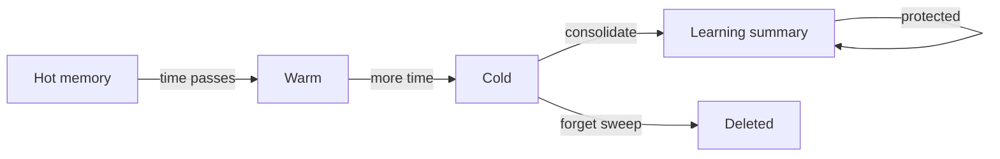

Not all memories should live forever. Linksee Memory uses an **Ebbinghaus-inspired forgetting curve** to naturally decay unimportant memories while permanently preserving critical ones.

## Heat bands

Every memory has a **heat score** (0-100) that decays over time since last access:

| Band | Heat range | Meaning |
|---|---|---|
| `hot` | 70-100 | Recently accessed, actively relevant |
| `warm` | 40-69 | Accessed within days, still relevant |
| `cold` | 10-39 | Not accessed recently, fading |
| `frozen` | 0-9 | Very old, candidate for forgetting |

Heat is computed using a decay function inspired by the Ebbinghaus forgetting curve — rapid initial decay that slows over time.

## Forgetting risk

When `forget` or `consolidate` runs, each memory gets a **forgetting risk** score:

```
risk = (1 - heat/100) × (1 - importance) × daysSinceAccess × (1 + daysSinceAccess/30) × altitudeMultiplier
```

### Risk thresholds

| Risk | Action |
|---|---|
| < 50 | **Keep** — still valuable |
| 50-200 | **Compress** — merge into a learning summary |
| > 200 | **Drop** — safe to delete |

## What's always protected

Some memories **never decay**, regardless of heat or age:

| Category | Why |
|---|---|
| Caveat layer | Pain lessons must never be relearned |
| Goal layer | Direction must persist |
| Pinned (importance >= 0.9) | Explicitly marked as critical |
| Mission altitude | Foundational purpose never fades |

## Accessing refreshes heat

Every `recall` that returns a memory **bumps its heat** back up. This means:

- Frequently used memories stay hot naturally
- Important but rarely accessed memories can be pinned (`importance >= 0.9`) to prevent decay
- Truly forgotten memories fade gracefully

<Tip>
  Use `recall` with `mark_accessed: false` for preview queries that shouldn't affect heat scores.
</Tip>

## Consolidation lifecycle



Cold memories are candidates for `consolidate`, which clusters them by (entity, layer) and produces a single learning-layer summary. The originals are deleted, but the essential knowledge is preserved in compressed form.
