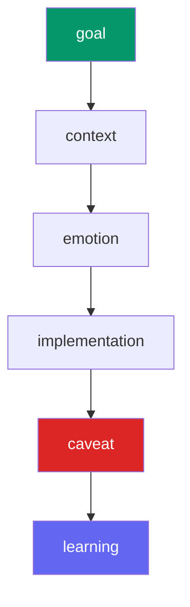

Most agent memory systems store everything in a flat list. Linksee Memory organizes memories into **6 cognitive layers**, each with different retention and retrieval behavior.

## The 6 layers

<AccordionGroup>
  <Accordion title="goal" icon="bullseye">
    **WHY this work exists.** The target outcome. Persists across sessions so the agent doesn't drift.

    - Never auto-forgotten (risk = 0)
    - Set at session start or when the user states a new objective
    - Example: *"Ship v1.0 by end of Q2 with cross-agent recall and token-saving"*
  </Accordion>

  <Accordion title="context" icon="clock">
    **WHY THIS, NOW.** Situational timing, background info, reasons for current priorities.

    - Normal decay rate
    - Consolidated after going cold
    - Example: *"Vercel had a security incident in April — rotating all API keys across projects"*
  </Accordion>

  <Accordion title="emotion" icon="face-smile">
    **User tone and sentiment.** Frustration, excitement, urgency expressed during work.

    - Normal decay rate
    - Helps agents calibrate tone in future sessions
    - Example: *"User frustrated with freee API pagination — 3 sessions debugging"*
  </Accordion>

  <Accordion title="implementation" icon="code">
    **HOW it was done.** What worked, what failed, technical details of execution.

    - Normal decay rate
    - Most common layer for day-to-day memories
    - Example: *"Switched from REST to GraphQL for freee sync — 3x faster batch queries"*
  </Accordion>

  <Accordion title="caveat" icon="triangle-exclamation">
    **PAIN lessons.** "Never X when Y." The protected pile of things you don't want to relearn.

    - **Always protected** — never auto-forgotten, never consolidated
    - Start with a verb: "Never", "Always", "Watch out"
    - Example: *"Never use pgbouncer session mode with Supabase — prepared statement conflicts"*
  </Accordion>

  <Accordion title="learning" icon="graduation-cap">
    **GROWTH.** Decisions made, insights gained, patterns recognized.

    - Normal decay rate but typically higher importance
    - Target layer for consolidation output
    - Example: *"freee webhook reliability is ~95% — always implement polling fallback"*
  </Accordion>
</AccordionGroup>

## Layer aliases

You don't need to remember exact layer names. Common aliases are automatically resolved:

| You say | Stored as |
|---|---|
| `why`, `intent`, `targets` | `goal` |
| `background`, `reason`, `situation`, `timing` | `context` |
| `tone`, `feelings`, `mood` | `emotion` |
| `impl`, `how`, `tried`, `success`, `failure` | `implementation` |
| `warning`, `pain`, `pitfall`, `dont`, `rule` | `caveat` |
| `decision`, `insight`, `growth`, `learned` | `learning` |

## Retention behavior

| Layer | Auto-forget | Consolidation target | Protection |
|---|---|---|---|
| `goal` | Never | No | Implicit |
| `context` | Normal | Yes → `learning` | No |
| `emotion` | Normal | Yes → `learning` | No |
| `implementation` | Normal | Yes → `learning` | No |
| `caveat` | Never | No | Always |
| `learning` | Normal | No (already target) | No |

## Why layers matter

Without layers, `recall("Supabase")` returns a wall of undifferentiated text. With layers, the agent can:

- Start with `goal` to understand direction
- Check `caveat` before making changes
- Skim `implementation` for prior approaches
- Use `learning` for distilled wisdom

This is the difference between "I read my notes" and "I understand my history."
