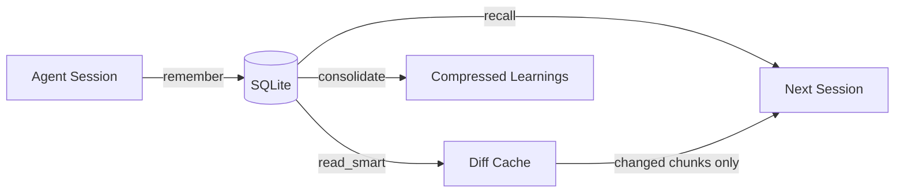

## What is Linksee Memory?

Linksee Memory is a **local-first MCP server** that gives every AI agent on your machine persistent, structured memory.

Sessions end. Agents forget. Linksee Memory fixes that.

It stores not just *what happened*, but **why it failed**, **how you fixed it**, and **what to never do again** — organized across 6 cognitive layers, shared via a single SQLite file.

<CardGroup cols={2}>
  <Card title="Cross-agent" icon="link">
    Claude Code, Cursor, Windsurf, OpenAI Codex, Gemini CLI — one memory, all agents.
  </Card>
  <Card title="Token-saving" icon="bolt">
    AST-aware file diff cache. Up to 99% token reduction on re-reads.
  </Card>
  <Card title="WHY-layered" icon="layer-group">
    6 layers: goal / context / emotion / implementation / caveat / learning.
  </Card>
  <Card title="Local-first" icon="hard-drive">
    No cloud. No account. One SQLite file on your machine.
  </Card>
</CardGroup>

## Quick Start

Install with a single command:

```bash
npm install -g linksee-memory
```

Add to your MCP client config:

```json claude_desktop_config.json
{
  "mcpServers": {
    "linksee-memory": {
      "command": "linksee-memory"
    }
  }
}
```

Restart your agent. Done.

<Tip>
  Linksee Memory works with **any MCP-compatible client** — Claude Desktop, Claude Code, Cursor, Windsurf, Cline, and more.
</Tip>

## Key Features

- **8 tools** — `remember`, `recall`, `update_memory`, `list_entities`, `forget`, `consolidate`, `recall_file`, `read_smart`
- **4 static resources** — `memory://stats`, `memory://hot`, `memory://recent`, `memory://caveats`
- **3 resource templates** — `memory://entity/{name}`, `memory://layer/{layer}`, `memory://memory/{id}`
- **5 prompts** — session summarization, caveat extraction, recall-and-write discipline, entity handoff, weekly consolidation
- **Ebbinghaus forgetting curve** — cold memories fade; caveats and goals are protected forever
- **AST-aware chunking** — TS/JS/Python files are split by function/class, not arbitrary line counts
- **Bilingual** — full Japanese + English support with trigram FTS5 tokenizer

## How It Works



1. **During a session**, the agent calls `remember` to store decisions, caveats, and context
2. **On the next session**, the agent calls `recall` to retrieve relevant memories ranked by relevance, heat, and importance
3. **For file re-reads**, `read_smart` returns only changed chunks — saving 50-99% tokens
4. **Over time**, `consolidate` compresses cold memories into learning-layer summaries while preserving caveats

## System Requirements

- Node.js 20+
- Any MCP-compatible client
- ~10 MB disk space for the SQLite database

## Next Steps

<CardGroup cols={2}>
  <Card title="Installation" icon="download" href="/installation">
    Detailed setup for every MCP client
  </Card>
  <Card title="Quick Start" icon="rocket" href="/quickstart">
    Your first remember → recall flow in 2 minutes
  </Card>
  <Card title="Memory Layers" icon="layer-group" href="/concepts/memory-layers">
    Understand the 6-layer structure
  </Card>
  <Card title="Tools Reference" icon="wrench" href="/tools/remember">
    Full API reference for all 8 tools
  </Card>
</CardGroup>
