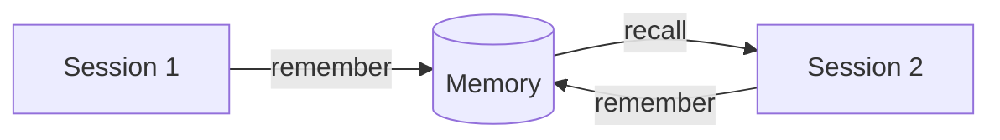

## The basic flow

Linksee Memory has one core loop: **remember → recall → act**.



## Step 1: Remember something

In any conversation with your AI agent, say:

> "Remember that our production database is PostgreSQL 16 on Supabase, and we had a connection pooling issue last week that was fixed by switching to transaction mode."

The agent calls `remember` and stores this as structured memory:
- **Entity**: your project name
- **Layer**: `implementation` (how it was done)
- **Content**: the PostgreSQL + pooling fix details

<Note>
  You can also say **"use linksee"** or **"don't forget this"** to trigger memory storage.
</Note>

## Step 2: Add a caveat

Caveats are the most valuable layer — pain lessons that should never be forgotten:

> "Linksee caveat: Never use pgbouncer in session mode with Supabase — it causes prepared statement conflicts. Always use transaction mode."

This gets stored in the **caveat layer** with `protected = true` — it will never be auto-forgotten.

## Step 3: Recall in a new session

Start a fresh session. Ask:

> "I'm about to set up a new Supabase project. What do I need to know? Check linksee."

The agent calls `recall` and returns your memories, ranked by relevance:

```json
{
  "memories": [
    {
      "id": 42,
      "layer": "caveat",
      "content": "Never use pgbouncer in session mode with Supabase...",
      "importance": 0.95,
      "match_reasons": ["content_match_fts", "caveat_protected", "heat:hot"]
    },
    {
      "id": 41,
      "layer": "implementation",
      "content": "Production database is PostgreSQL 16 on Supabase...",
      "importance": 0.6,
      "match_reasons": ["content_match_fts", "entity_name_match"]
    }
  ]
}
```

The caveat surfaces first because it's protected and highly important.

## Step 4: Use read_smart for files

When re-reading a file you've seen before:

> "Read src/db/connection.ts using linksee read_smart"

First read returns full content. On subsequent reads, if the file hasn't changed, you get:

```json
{
  "status": "unchanged",
  "chunks": [
    { "name": "createPool", "hash": "a1b2c3...", "lines": "1-25" },
    { "name": "getConnection", "hash": "d4e5f6...", "lines": "27-45" }
  ],
  "tokens_saved": "~850 (was ~900, now ~50)"
}
```

**~95% token savings** on unchanged files.

## What to remember

Not everything needs to be memorized. Focus on:

| Worth remembering | Skip |
|---|---|
| Decisions and why you made them | Routine code changes |
| Pain lessons and gotchas | Temporary debug output |
| Architecture choices | One-off questions |
| User preferences | Content that's already in docs |
| Project-specific conventions | Generic knowledge |

<Tip>
  The `summarize-session` prompt can automatically extract the right memories from a session transcript. Use it at the end of important sessions.
</Tip>

## Next steps

<CardGroup cols={2}>
  <Card title="Memory Layers" icon="layer-group" href="/concepts/memory-layers">
    Understand goal / context / emotion / implementation / caveat / learning
  </Card>
  <Card title="Token Saving" icon="bolt" href="/concepts/token-saving">
    How read_smart saves 50-99% tokens with AST-aware diffing
  </Card>
  <Card title="Tools Reference" icon="wrench" href="/tools/remember">
    Full parameter docs for all 8 tools
  </Card>
  <Card title="Prompts" icon="message" href="/prompts/overview">
    5 built-in prompts for common workflows
  </Card>
</CardGroup>
