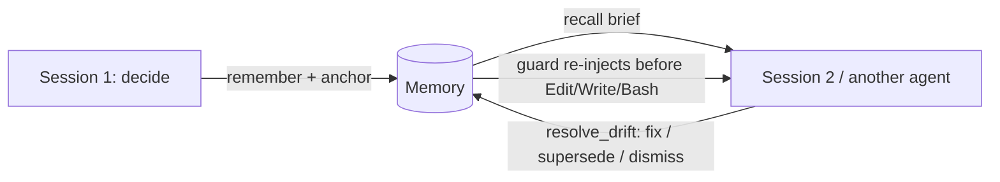

## The loop

Linksee Memory has one loop: **decide → remember (and enforce) → hand over → the next agent acts on it, or is stopped before it doesn't.**


```mermaid
graph LR
    A[Session 1: decide] -->|remember + anchor| B[(Memory)]
    B -->|recall brief| C[Session 2 / another agent]
    B -->|guard re-injects before Edit/Write/Bash| C
    C -->|resolve_drift: fix / supersede / dismiss| B
```

## Step 0: Set up (once)

```bash
npx -y linksee-memory setup
```

Registers the MCP server, installs the skill, wires the session-capture hook and the re-injection guard for every repo on the machine. Restart your agent.

## Step 1: Record a decision — and enforce it

In any conversation:

> "We're going with Postgres for the primary store. MongoDB is rejected — it doesn't meet the strong-consistency requirement. Remember that, and hold me to it."

The agent calls `remember` once:

```json
{
  "content": "Postgres is the primary store. MongoDB rejected: does not meet the strong-consistency requirement.",
  "anchor": { "violation_signal": ["mongoose", "MongoClient", "MONGODB_URI"], "affects": ["src/db/**"] }
}
```

`content` is the only required field — the entity defaults to the project you are in, the layer to `learning`. Because `anchor` is set, the memory is also declared as a drift anchor. The response says what that bought you:

```json
{ "ok": true, "memory_id": 512, "anchor_id": 12, "anchor_kind": "decision",
  "enforced": "contradictions are detected at the gate; re-injected on boot and in scope" }
```

## Step 2: Add a caveat

Caveats are the layer that must never be forgotten — pain lessons:

> "Linksee caveat: never use pgbouncer in session mode with Supabase — it causes prepared statement conflicts. Always use transaction mode."

Stored in the `caveat` layer with `protected = true`. It will not be auto-forgotten, and it is re-surfaced when the same ground is touched.

## Step 3: Hand over — start a new session

Open a fresh session (or Cursor, or Codex — same file). The agent's first call is `recall()` with no arguments:

```json
{
  "brief": true,
  "triage": "14 anchors: 🔵 3 verified · ⚫ 11 unverified",
  "attention": [],
  "where": { "project": "myapp", "you_are_here": "You are at \"db-layer\" in stage 「導入」. Touching it implicates 2 node(s): api, docs." },
  "open_loops": { "proposals": 0, "distill_queue": 2, "friction": 0 },
  "entities": [{ "name": "myapp", "kind": "project", "memories": 41 }],
  "next": ["recall({ query }) to search; …", "drift_status() for the full truth map; …"]
}
```

Nothing to re-explain. Then search for what the task needs:

> "I'm about to set up the new data layer. Check linksee."

```json
{ "memories": [
  { "id": 511, "layer": "caveat", "content": { "what": "Never use pgbouncer in session mode with Supabase…" }, "pinned": true },
  { "id": 512, "layer": "learning", "content": { "what": "Postgres is the primary store. MongoDB rejected…", "anchor_id": 12 } }
] }
```

## Step 4: Watch the guard catch the contradiction

Two weeks later, a session that never saw Step 1 starts writing `import mongoose from "mongoose"`. Before the edit runs:

```
⚠ Heads up — this action contradicts a decision you locked earlier.
• [#12] "Postgres is the primary store. MongoDB rejected…" — does not meet the strong-consistency requirement.
  ↳ your action contains `mongoose` → contradicts it.

If you are intentionally changing this decision, supersede it on the record:
  resolve_drift(anchor_id: 12, action: 'supersede', superseded_by: <new anchor>).
If this match is simply wrong, say so and it stops firing:
  resolve_drift(anchor_id: 12, action: 'dismiss', hit_term: 'mongoose', rationale: '<why>').
```

Harden it — `resolve_drift({ anchor_id: 12, action: "harden" })` — and the same edit is **denied** instead of warned.

## Step 5: Change your mind on the record

> "We're switching to MongoDB after all — the consistency requirement was dropped."

```json
{ "content": "MongoDB adopted for the primary store; consistency requirement relaxed 2026-09-21.",
  "anchor": { "violation_signal": ["postgres", "pg"], "affects": ["src/db/**"] } }
```
then
```json
{ "anchor_id": 12, "action": "supersede", "superseded_by": 19, "rationale": "Requirement relaxed." }
```

#12 stops firing; #19 starts. The next agent inherits the change *and* the reason — that is what "with the reasons attached" means.

## Step 6: Read files cheaply

> "Read src/db/connection.ts using linksee read_smart"

First read returns full content. Unchanged re-reads return ~50 tokens; modified files return only the changed chunks.

## What to remember

| Worth remembering | Skip |
|---|---|
| Decisions and why — with `anchor` if they should be enforced | Routine code changes |
| Pain lessons and gotchas (caveats) | Temporary debug output |
| Architecture choices | One-off questions |
| Options you presented that went unaddressed (`declare_anchor({ kind: "proposal" })`) | Content that's already in docs |

<Tip>
  The session-capture hook records raw decisions and caveats automatically. Rules archive the acknowledgements and stale ones; `recall({ dream: true })` shows the rest for you to rewrite into clean what/why.
</Tip>

## Next steps

<CardGroup cols={2}>
  <Card title="Tools" icon="wrench" href="/tools/recall">
    The six tools, with every parameter
  </Card>
  <Card title="Product map & drift" icon="map" href="/concepts/product-map">
    How drift is measured, and `recall({ where })`
  </Card>
  <Card title="Memory Layers" icon="layer-group" href="/concepts/memory-layers">
    goal / context / emotion / implementation / caveat / learning
  </Card>
  <Card title="Token Saving" icon="bolt" href="/concepts/token-saving">
    How read_smart saves 50–99% on re-reads
  </Card>
</CardGroup>
