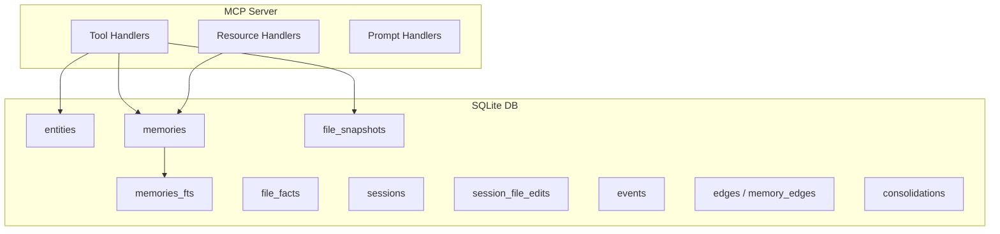

## Overview

Linksee Memory is a single-process Node.js MCP server using **SQLite** (via `better-sqlite3`) with WAL mode for concurrent read access.



## Database tables

### Core tables

| Table | Purpose |
|---|---|
| `entities` | People, companies, projects, concepts, files with normalized dedup and momentum cache |
| `memories` | 6-layer structured memories with importance, protected flag, thread_id, and 3 virtual generated columns |
| `memories_fts` | FTS5 virtual table with trigram tokenizer for full-text search (supports CJK) |

### Relationship tables

| Table | Purpose |
|---|---|
| `memory_edges` | Directed relationships between memories (supersedes, resolves, implements, contradicts, extends) |
| `edges` | Entity-to-entity graph relationships |

### File tracking

| Table | Purpose |
|---|---|
| `file_snapshots` | Diff cache for `read_smart` — per-file content snapshots with chunk hashes |
| `file_facts` | Extracted facts per file chunk |
| `sessions` | Agent/conversation tracking |
| `session_file_edits` | Conversation-to-file linkage with `context_snippet` |

### Lifecycle

| Table | Purpose |
|---|---|
| `events` | Time-series log driving momentum calculation |
| `consolidations` | Audit trail of what got compressed into what |
| `meta` | Schema version tracking (currently v7) |

## Virtual generated columns

The `memories` table has 3 virtual columns auto-extracted from structured JSON content:

```sql
altitude  TEXT GENERATED ALWAYS AS (json_extract(content, '$.altitude'))
mem_type  TEXT GENERATED ALWAYS AS (json_extract(content, '$.type'))
mem_state TEXT GENERATED ALWAYS AS (json_extract(content, '$.state'))
```

These enable SQL-level filtering without parsing JSON at query time.

## FTS5 configuration

```sql
CREATE VIRTUAL TABLE memories_fts USING fts5(
  content,
  content=memories,
  content_rowid=id,
  tokenize='trigram'
);
```

The trigram tokenizer handles both English and Japanese text without language-specific stemming.

## SQLite pragmas

```sql
PRAGMA journal_mode = WAL;
PRAGMA foreign_keys = ON;
```

WAL mode allows concurrent reads from multiple MCP clients while maintaining write safety.
